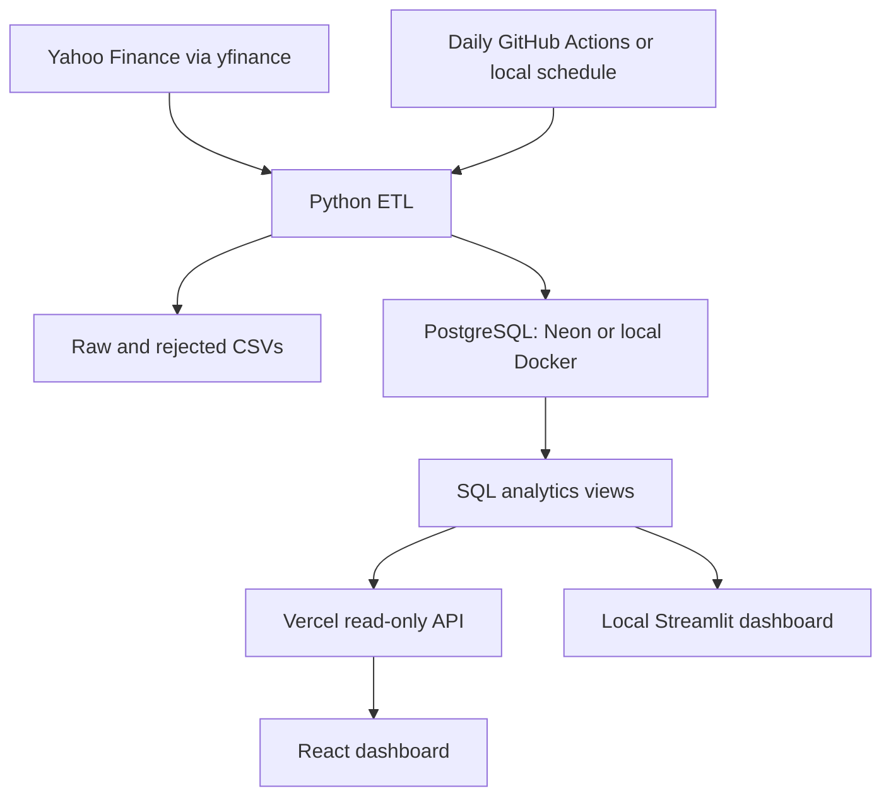

# Data Platform — Stock Market Analytics

A portfolio-ready stock analytics project with a **React dashboard for Vercel**, a **Python ingestion pipeline**, **PostgreSQL SQL analytics**, and the original **Streamlit dashboard for local use**.

> Designed to run at ₹0 / $0 using Vercel Hobby for personal use, Neon Free PostgreSQL, and standard GitHub Actions runners in this public repository. No credit card or paid plan is required. Stay on the free plans and within their quotas; no paid fallback is configured.

## Architecture



## What is included

- Four React views: Overview, Performance, Volume and Data.
- A visible, persistent **Light / Dark** switch; mobile layout; interactive Recharts charts.
- Shared-date stock comparisons, OHLCV inspection and complete-selection CSV export.
- SQL moving averages, daily returns, volatility, monthly returns and all-history summaries.
- PostgreSQL constraints and idempotent upserts; seven-day overlap and weekly full refresh.
- Raw and rejected-record audit files; per-symbol failure isolation and pipeline run history.
- Explicit synthetic demo mode (the shipped default in `config/dashboard.json`), with a visible warning. No silent fallback on database errors.
- Daily scheduled ingestion at **03:00 UTC / 08:30 IST**, plus manual runs.
- Python and JavaScript tests. The local Docker/Streamlit version remains available.

## Start the React demo locally

Install Node.js 22 or 24, then from this directory:

```bash
npm ci
```

PowerShell:

```powershell
$env:DEMO_MODE="true"
npm run dev
```

Linux/macOS:

```bash
DEMO_MODE=true npm run dev
```

Open the address Vite prints. Demo prices are synthetic fixtures, not market observations. The demo contains fixed historical business-day dates and is not presented as a current feed. No API key, Python environment or database is needed to explore this explicitly enabled demo.

```bash
npm test
npm run build
```

## Deploy on Vercel

Import **Gurkamalvirk/Data-platform** from GitHub. Set:

| Setting | Value |
|---|---|
| Framework | Vite |
| Root directory | Repository root (leave blank) |
| Install command | `npm ci` |
| Build command | `npm run build` |
| Output directory | `dist` |
| Node.js | 22.x or 24.x |
| Initial mode | Demo, explicitly configured in `config/dashboard.json` |

The `api/market.js` endpoint becomes a Vercel Node function automatically. Python ingestion and Docker are not started inside Vercel. **Do not use a Streamlit start command on Vercel.** Keep the project on Hobby for this personal portfolio.

For the real database-backed version, follow **[Neon setup](docs/NEON_SETUP.md)**. Set server-side `DATABASE_URL` and `DEMO_MODE=false` in Vercel, then redeploy. Never use a `VITE_` prefix for a secret: Vite exposes those values to the browser.

If deployed directly through the Vercel API, connect the existing Vercel project under **Settings → Git → Connect Git Repository → Gurkamalvirk/Data-platform** to enable automatic deployments from future pushes. The initial API deployment does not create this Git connection.

## Database setup and daily updates

1. Create a **Neon Free** project. No credit card is needed.
2. Copy its **direct connection URL** with connection pooling disabled; retain `sslmode=require`.
3. Store the URL as `DATABASE_URL` in your local `.env`, Vercel Environment Variables, and this repository's Actions secrets. Instructions and placeholders are in [NEON_SETUP.md](docs/NEON_SETUP.md).
4. Initialize and ingest locally, or use **Actions → Daily market ingestion → Run workflow**. The workflow initializes tables/views automatically before fetching data.
5. After successful ingestion, turn off demo mode on Vercel and redeploy.

The workflow does nothing except report missing configuration until the secret exists. It uses standard `ubuntu-latest` runners, has a ten-minute timeout, and does not upload downloaded market data as public artifacts. GitHub schedules are best-effort; they may run late and can be disabled after prolonged repository inactivity. Check the Actions tab. Public-repository standard runners are free; review billing rules before changing repository visibility or runner type.

Neon Free can suspend at its quota and scale to zero when idle; first access may be slower. The API uses read-only transactions, a seven-second request timeout, and a five-minute shared response cache. It returns at most five years / 12,000 daily observations and fails explicitly if the row cap is exceeded. Daily snapshots do not need high-frequency polling. Keep the initial five-stock universe for the free demonstration.

## Source and data meaning

The stock universe is defined **once** in `config/stocks.json`; both the Python pipeline and hosted demo read it. Pipeline dates, overlap and pacing live in `config/pipeline.json`.

Live data uses Yahoo's public HTTP APIs through the unofficial `yfinance` wrapper, with no API key. Yahoo access is intended for personal use and is not a guaranteed service; rate limits or timeouts can prevent ingestion. There is no automatic paid source or fabricated fallback. The Python pipeline retries serially and continues other stocks after a failure. Review source terms before making downloaded market data publicly available; the deployed demo does not redistribute actual Yahoo observations.

Prices use `auto_adjust=False`, as supplied by the provider. Price returns exclude dividends. SQL MA windows use 7 and 30 trading observations; volatility is the sample standard deviation of 30 daily returns, not annualized. The API reads SQL windows computed before filtering. The browser performs simple selected-period ratios and common-date rebasing for interactive filters. Monthly returns use consecutive month-end available closes; the current month can be incomplete.

## Project map

| Path | Responsibility |
|---|---|
| `web/` | React application, styles, charts and interactive selection calculations |
| `api/market.js` | GET/HEAD-only Vercel endpoint; no public write or ingestion route |
| `server/market.js` | Neon HTTP queries in a read-only transaction |
| `server/demo.js` | Explicit deterministic synthetic dataset |
| `src/` | Original modular Python ingestion, transformation, database and analytics code |
| `sql/` | PostgreSQL schema, views and example queries |
| `config/` | Shared stock universe and Python pipeline settings |
| `dashboard/` | Original local Streamlit dashboard |
| `.github/workflows/ingest.yml` | Daily/manual Python ingestion into Neon |
| `tests/` | Python validation/database tests and JavaScript analytics/API tests |
| `docs/LOCAL_SETUP.md` | Original local Docker and Streamlit workflow |
| `docs/NEON_SETUP.md` | Exact environment-variable and hosted setup instructions |
| `BUILD_GUIDE.md` | Progressive build guide with complete project source |
| `VALIDATION.md` | What was tested and what still requires external configuration |

## Test commands

```bash
npm ci
npm test
npm run build
python -m pip install -r requirements.txt
python -m pytest -q
```

PostgreSQL integration tests are opt-in. Set `RUN_DB_TESTS=1` and run pytest with a configured local/direct database URL. They use a unique rollback schema and do not insert fixtures into application tables. The role must be allowed to create schemas.

## Secrets

**Never commit `.env`.** Copy `.env.example` into `.env` for local use and replace placeholders there. For hosted use, secrets belong in Vercel Environment Variables and GitHub Actions secrets, not source files. `.gitignore` excludes local secrets and runtime data. `python main.py --check-config` confirms that credentials are configured without printing them.

## Local version

See [LOCAL_SETUP.md](docs/LOCAL_SETUP.md) for Docker Compose, PowerShell commands and Streamlit. Local PostgreSQL uses the `POSTGRES_*` variables; hosted PostgreSQL uses `DATABASE_URL`, which takes precedence. Streamlit and React can read the same Neon database. The API used by the React version expects Neon; use Streamlit with the local Docker database.

## Future improvements

Airflow, Spark, Kafka, real-time ingestion and a cloud data warehouse remain intentionally unimplemented. The five-stock daily workload does not justify them. Future work could add exchange calendars, pagination for larger stock universes, source licensing appropriate for a public live-data service, and stronger cross-provider data checks.

## References

- [Vercel Vite documentation](https://vercel.com/docs/frameworks/frontend/vite)
- [Neon Free pricing](https://neon.com/pricing)
- [GitHub Actions billing](https://docs.github.com/en/billing/concepts/product-billing/github-actions)
- [yfinance documentation and data terms](https://ranaroussi.github.io/yfinance/)
