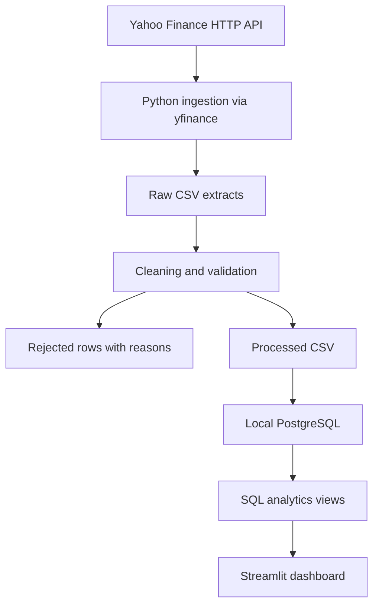

# Stock Market Analytics Pipeline

A local, end-to-end daily stock analytics project for a junior data engineer or analyst portfolio. Python retrieves OHLCV data, preserves source-shaped extracts, quarantines invalid rows, and upserts validated records into PostgreSQL. SQL window functions drive a compact Streamlit dashboard.

> This project is designed to run at ₹0 / $0 using local and free/open-source components.

No paid API, cloud deployment, billing account, or credit card is required. Docker Desktop is free for personal/student use; Docker Engine on Linux is another free option. Existing hardware, internet access and electricity are assumed.

## Architecture



## Features and technology

- Python, Pandas and NumPy for modular ETL and data quality.
- Yahoo Finance public HTTP API via yfinance: daily prices, no API key.
- PostgreSQL 16: relational schema, constraints, indexes and atomic upserts.
- SQL: LAG, rolling windows, period summaries and shared-date comparisons.
- Streamlit and Plotly: interactive charts, native Light/Dark theme selection.
- Docker Compose for local PostgreSQL; pytest for meaningful checks.
- Configurable symbols; serial retrieval, bounded retries, audit logs and run status.

This uses an unofficial wrapper around a public HTTP API, not a supported commercial REST contract. The original HTTP JSON is decoded by yfinance; raw CSV preserves the wrapper output before our transformation, not the original HTTP bytes. Historical Yahoo data is for personal use; publish code and synthetic screenshots rather than redistributing downloaded data. Yahoo does not provide a guaranteed free request quota or service SLA. The pipeline makes serial requests, pauses between symbols, retries only three times and stops retrying failures. There is no paid fallback or automatic upgrade. Respect provider restrictions; demo mode remains usable offline after dependencies are installed.

## Quick start — Windows PowerShell

Install Python 3.12 and Docker Desktop with the WSL2 backend. Start Docker Desktop and use its free personal/student option. Extract the project, then open PowerShell in the project folder.

```powershell
py -3.12 -m venv .venv
.\.venv\Scripts\python.exe -m pip install -r requirements.txt
Copy-Item .env.example .env
notepad .env
```

Replace `replace_with_your_local_password` with a password you choose locally. Save the file. No API account is needed, and you do not need to share this password.

```powershell
.\.venv\Scripts\python.exe main.py --check-config
docker compose up -d --wait
.\.venv\Scripts\python.exe main.py --init-db
.\.venv\Scripts\python.exe main.py
.\.venv\Scripts\python.exe -m streamlit run dashboard/app.py
```

Open http://localhost:8501. Expected pipeline output: `Starting ingestion`, per-symbol retrieval/upsert counts, then `Ingestion completed: success; 0 failed stocks`. Counts vary with the configured dates and available trading sessions.

Use `python` in subsequent examples if your virtual environment is activated; otherwise use the full `.venv` interpreter path shown above. Running from the project root ensures Streamlit finds its theme configuration.

## Linux / macOS

Install Python 3.12 and free local Docker/Compose, then:

```bash
python3.12 -m venv .venv
source .venv/bin/activate
python -m pip install -r requirements.txt
cp .env.example .env
# Edit .env and replace the placeholder password before continuing.
python main.py --check-config
docker compose up -d --wait
python main.py --init-db
python main.py
python -m streamlit run dashboard/app.py
```

## Environment variables

Create `.env` in the project root by copying `.env.example`. All values are for your own local database, created by Docker Compose; obtaining them is completely free. There is no market-data API key.

```dotenv
POSTGRES_USER=stock_user
POSTGRES_PASSWORD=replace_with_your_local_password
POSTGRES_DB=stocks
POSTGRES_HOST=localhost
POSTGRES_PORT=5432
```

| Variable | Purpose and where it comes from |
|---|---|
| POSTGRES_USER | Local database username; keep the example or choose your own |
| POSTGRES_PASSWORD | Choose a new local password; Compose uses it to initialize PostgreSQL |
| POSTGRES_DB | Local database name created by Compose |
| POSTGRES_HOST | `localhost` because Python runs on your computer |
| POSTGRES_PORT | Local port; change if 5432 is already occupied |

Use a long alphanumeric password to avoid `.env` interpolation/quoting complications. No quotes are needed for those values. Python loads `.env` with python-dotenv; existing shell environment variables take precedence. Compose also reads `.env` from this directory.

`python main.py --check-config` validates presence and format without connecting or printing secrets. Expected: `Configuration loaded; local database credentials present (password hidden).` Then `python main.py --init-db` verifies the actual connection.

**Never commit `.env` to GitHub.** It is already excluded by `.gitignore`. Run `git check-ignore .env` in a Git repository to confirm; expected output is `.env`. Never paste real passwords into source files.

PostgreSQL initialization variables apply only when its data volume is first created. Changing a password in `.env` later does not change an existing database password. Update the database password deliberately using PostgreSQL administration; do not delete a volume containing data you need.

## Project structure

```text
config/stocks.json and config/pipeline.json       Stock universe, history start and request pacing
src/settings.py          Configuration and local paths
src/ingestion/           Live retrieval and explicit synthetic demo generator
src/transformation/      Normalization, validation and rejection audit
src/database/            Connection, schema initialization and upserts
src/analytics/           Parameterized SQL queries for the dashboard
sql/                    Tables, views and example inspection queries
dashboard/app.py         Streamlit application
.streamlit/config.toml   Native light and dark themes
data/raw/               Provider-shaped CSV before validation (gitignored)
data/processed/         Standardized valid CSV (gitignored)
data/rejected/          Invalid/duplicate rows with reasons (gitignored)
logs/pipeline.log        Operational log (gitignored)
tests/                  Unit and real-PostgreSQL integration tests
BUILD_GUIDE.md          All 12 stages, complete files, commands and expected results
```

## Database schema

`stocks` has a generated `stock_id` primary key, unique `symbol`, `company_name`, and `sector`. `daily_prices` has a generated `price_id`, a stock foreign key, session `date`, OHLC prices, and integer volume. A unique `(stock_id, date)` constraint supports upserts and stock/date lookup; a separate date index supports cross-stock queries. Database constraints enforce positive prices, valid OHLC ranges and nonnegative volume.

`pipeline_runs` records source, start/end timestamps and success/partial/failed status. `dataset_metadata` prevents accidental mixing of synthetic and live data. A session advisory lock prevents overlapping ETL writers. Each stock is committed independently; a failed stock cannot roll back another completed stock. Abrupt process termination can leave an audit run marked `running`; review its timestamps and rerun safely.

## Data pipeline

1. Read the centralized stock configuration.
2. Fetch configured history on first run; subsequently start seven calendar days before each stock's latest stored date. Fetches exclude today to avoid incomplete daily bars.
3. Preserve each extract with a unique run ID.
4. Normalize names and types, reject invalid dates/numbers/ranges/volumes, and keep the last valid duplicate while auditing the other rows.
5. Save clean and rejected rows separately; empty valid results count as a stock failure.
6. Upsert by stock/date in PostgreSQL and record the run result. Exit code 1 means partial or total failure; 0 means success.

`python main.py --full-refresh` rechecks all configured historical prices. Run this periodically to pick up revisions outside the incremental overlap. Prices use `auto_adjust=False`: returns are close-to-close price returns as supplied, not dividend-inclusive investment returns. Historical provider adjustments can change; a full refresh aligns past rows with the provider's latest history. No exchange calendar is imposed; unavailable sessions are not filled or fabricated.

## SQL analytics and definitions

| Metric | Definition |
|---|---|
| Daily return | Current close / prior available session close − 1; first row is NULL |
| 7 / 30 moving average | Mean of 7 / 30 trading-session closes; requires a full window |
| Daily-frequency volatility | Sample standard deviation of the last 30 daily returns; unannualized and NULL until 30 returns exist |
| Intraday range | (High − low) / open; distinct from statistical volatility |
| Average trading volume | Arithmetic mean of daily share volume |
| Highest-volume / best / worst day | SQL ranking; ties choose the most recent date |
| Highest / lowest close | Maximum / minimum stored closing price |
| Monthly return | Last available close in month / prior month's last available close − 1 |
| Total price return | Last stored close / first stored close − 1 |
| Selected-period return | Last available close in selection / first available close in selection − 1 |

The latest monthly result is month-to-date if the month is unfinished; the first available month has no previous-month comparison. Rolling metrics are computed on the full stored history before the UI applies date filters. Comparison lines use common actual sessions across all selected stocks, starting at 0%. No forward filling is used. Missing dates can make consecutive available observations more than one trading day apart.

## Dashboard

- **Overview:** closing price, latest session change, selected-period return, average volume, price/MA chart and optional volatility chart.
- **Performance:** multiple-stock comparison with a common baseline; best/worst period performer and highest volume on the common final session.
- **Volume:** volume chart and peak-volume date in the selected interval.
- **Data:** records, CSV export, SQL all-history summaries, monthly returns and run history.

To switch **☀ Light / 🌙 Dark**, open the top-right **⋮ → Settings → Theme** and choose **Light** or **Dark**. This is Streamlit's native theme control; it updates controls, tables, sidebar and chart theme consistently, rather than applying partial CSS overrides. Both custom theme palettes are configured. The sidebar includes a reminder. The stock universe begins with AAPL, MSFT, GOOGL, AMZN and NVDA; edit `config/stocks.json and config/pipeline.json` to change it.

Screenshot placeholders (capture after loading your local instance):
- `docs/screenshots/overview-light.png` — Overview in Light mode.
- `docs/screenshots/overview-dark.png` — Overview in Dark mode.
- `docs/screenshots/performance.png` — Shared-date multi-stock comparison.

## Offline demo

On an empty database, run `python main.py --demo`, then start Streamlit normally. Prices are deterministic synthetic business-day fixtures, prominently labelled **SYNTHETIC DEMO**. Business days in these fixtures are not an exchange holiday calendar. No market-data request is made. Repeated demo runs exercise the same PostgreSQL path and upsert logic.

Live and synthetic data cannot coexist in the same database. For a second dataset, create a separate database in PostgreSQL with your local user's ownership, then change `POSTGRES_DB` in `.env`. A simple option is to copy the project to a separately named directory, choose another port and database name, and start that directory's Compose project with a separate `-p` name. Keep both demo invocations and dashboard pointed at that same configuration. There is no silent fallback to fabricated prices.

## Tests

```bash
python -m pytest -q
```

The default run tests malformed records, name normalization, duplicate auditing and provider retry behavior. PostgreSQL integration tests are explicitly skipped unless enabled.

With PostgreSQL running and `.env` configured, on PowerShell:

```powershell
$env:RUN_DB_TESTS="1"
.\.venv\Scripts\python.exe -m pytest -q
Remove-Item Env:RUN_DB_TESTS
```

On Linux/macOS:

```bash
RUN_DB_TESTS=1 python -m pytest -q
```

Integration tests use a unique temporary schema in a rollback transaction. They verify actual PostgreSQL upserts, price constraints, daily returns, moving averages, volatility warm-up and monthly/total returns. They do not write fixtures into application tables. The database role must be allowed to create schemas.

## Local automation

Schedule after the US session has closed. Data ingestion deliberately excludes the current local date, so a daily next-morning run is suitable. The machine and PostgreSQL must be running; no cloud scheduler is used.

Windows Task Scheduler → Create Basic Task → Daily:

- Program: `C:\absolute\path\stock-market-pipeline\.venv\Scripts\python.exe`
- Arguments: `"C:\absolute\path\stock-market-pipeline\main.py"`
- Start in: `C:\absolute\path\stock-market-pipeline`
- Choose 08:00 IST daily; configure the task not to start another instance if already running.

Linux/macOS `crontab -e` example (08:00 in the machine's configured timezone):

```cron
0 8 * * * cd /absolute/path/stock-market-pipeline && .venv/bin/python main.py >> logs/scheduler.log 2>&1
```

For a demo-only database include `--demo` in the scheduled command. Schedule a separate weekly `--full-refresh` run for historical corrections. Check run status and the log after the first scheduled execution.

## Troubleshooting

- Database unavailable: start Docker Desktop; run `docker compose ps` and `docker compose logs db` locally. Verify host/port and password without sharing secrets.
- Live source throttled/unavailable: inspect the log, wait and retry later. Do not aggressively increase retry counts. Use a separate synthetic demo database when offline.
- No data: confirm the date range, configured symbols, pipeline status and rejected CSVs.
- Port occupied: choose another `POSTGRES_PORT` in `.env`, then recreate the Compose service.
- A stock fails: other stocks continue; the process exits 1, and the run records partial/failed status.
- Repeated runs: row count should remain stable when no new sessions appear; existing values may be updated. Check Data → Pipeline runs.
- Stop services without deleting data: `docker compose stop`. Database files persist in the named Docker volume.

## Interview talking points

Explain why a unique stock/date constraint and database upsert are safer than checking duplicates only in Python. Describe the overlap window and its limitation for historical corrections. Demonstrate a rejected record, a partial ingestion failure and the difference between a price return and dividend-inclusive total return. Explain why SQL windows are computed before dashboard filtering and why comparisons need a shared base date.

## Future improvements — intentionally not implemented

Airflow orchestration, Spark processing, Kafka streaming, real-time ingestion, cloud deployment and a cloud data warehouse could be considered for genuinely larger workloads. They add no value to this local five-stock daily pipeline today and are not part of its ₹0 setup.

## References

- https://ranaroussi.github.io/yfinance/ — source wrapper and personal-use data guidance.
- https://docs.streamlit.io/develop/api-reference/configuration/config.toml — switchable Light/Dark configuration.
- https://www.docker.com/products/personal/ — personal/student eligibility.
- https://www.postgresql.org/docs/16/sql-insert.html — ON CONFLICT upserts.
